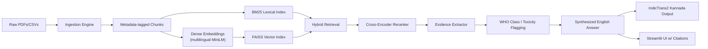

<div align="center">

# 🌾 AgriSafe-RAG
**Pesticide & Crop Protection Retrieval-Augmented Generation (RAG) System**

[](https://www.python.org/downloads/)
[](https://streamlit.io)
[](https://opensource.org/licenses/MIT)

*An intelligent, evidence-based decision support system for farmers and agricultural extension workers.*

</div>

## 📖 Overview

**AgriSafe-RAG** is a highly specialized, 12-hour-buildable MVP designed to address a critical agricultural challenge: providing fast, accurate, and safe guidance on approved pesticides, dosages, safety intervals, and precautions for specific crop-pest combinations. 

Instead of generating unverified answers, this system employs a conservative RAG architecture that strictly grounds every recommendation in trusted agricultural guidelines, including ICAR crop protection manuals, CIB&RC registered pesticide lists, and WHO safety sheets.

## 🎯 Key Features

- **Strict Evidence Grounding**: Every answer is directly sourced from retrieved documents. No hallucinated dosages or chemical recommendations.
- **Detailed Citations**: Responses include source type, crop, pest, publisher, year, and URL.
- **Toxicity Risk Flags**: Integrates WHO pesticide hazard classifications to alert users of Class I toxic chemicals.
- **Hybrid Retrieval Strategy**: Combines FAISS (dense embeddings via multilingual MiniLM) with BM25 (lexical indexing) to capture both semantic meaning and exact chemical/pest terminology.
- **Cross-Encoder Reranking**: Ensures the most relevant chunks are prioritized before answer synthesis.
- **Multilingual Support**: Supports translation into Kannada using IndicTrans2 models for localized extension worker support.

## 🏗️ Architecture



## 📂 Project Structure

```text
AgriSafe-RAG/
├── data/
│   ├── raw/                  # Source PDFs, CSVs, TXT files
│   ├── processed/            # Generated data chunks
│   ├── index/                # FAISS/BM25 index files
│   ├── metadata_manifest.csv # Metadata mapping for documents
│   ├── who_class_i_seed.csv  # WHO Class I toxicity dataset
│   └── eval/                 # Evaluation queries and results
├── src/pesticide_rag/        # Core RAG implementation
│   ├── ingest.py
│   ├── build_index.py
│   ├── rag.py
│   ├── toxicity.py
│   ├── translator.py
│   └── evaluate.py
├── streamlit_app.py          # Interactive web UI
├── requirements.txt          # Core dependencies
└── requirements-indictrans.txt # Translation dependencies
```

## 🚀 Getting Started

### 1. Environment Setup

```bash
# Create and activate virtual environment
python -m venv .venv
# On Windows:
.\.venv\Scripts\Activate.ps1
# On macOS/Linux:
# source .venv/bin/activate

# Install core dependencies
pip install -r requirements.txt

# Optional: Install Kannada translation dependencies
pip install -r requirements-indictrans.txt
```

### 2. Data Preparation

Place your source files (e.g., ICAR manuals) into `data/raw/` and update `data/metadata_manifest.csv` to ensure the `file_name` column perfectly matches your files.

### 3. Ingestion & Indexing

```bash
# Ingest documents to create chunks
python -m src.pesticide_rag.ingest

# Build FAISS and BM25 search indices
python -m src.pesticide_rag.build_index
```
*(Note: If FAISS is not yet installed, the app can run in a simple keyword mode directly from chunks).*

### 4. Run the Application

Launch the interactive UI:
```bash
streamlit run streamlit_app.py
```

### 5. Evaluation

Evaluate the system's accuracy using the provided query template:
```bash
python -m src.pesticide_rag.evaluate
```
*Evaluations use BERTScore (`distilbert-base-uncased`) to measure F1 scores against reference answers.*

---

## ⚠️ Safety Disclaimer

> **IMPORTANT**: This system is a prototype designed for decision-support and research purposes. Real-world pesticide application must **always** follow the official product label, local registration status, state agricultural department guidance, and the judgment of trained extension workers. The developers assume no liability for agricultural or health outcomes resulting from the use of this software.
