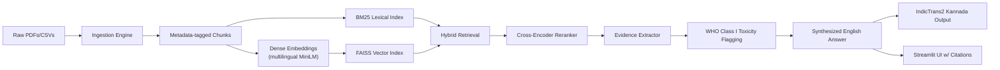

<div align="center">

#  Pesticide & Crop Protection RAG System

[](https://www.python.org/downloads/)
[](https://streamlit.io)
[](https://opensource.org/licenses/MIT)

*An intelligent, evidence-based decision support system for farmers and agricultural extension workers.*

</div>

This project is a 12-hour-buildable MVP for the assigned problem statement:

> Farmers and extension workers need fast, accurate guidance on approved pesticides, dosages, safety intervals, and precautions for crop-pest combinations. The system must ingest registration documents, ICAR crop protection manuals, and WHO pesticide safety sheets, then answer queries with citations and toxicity risk flags.

## Problem Discussion
Pesticide recommendations depend on crop, pest, active ingredient, formulation, dose unit, pre-harvest interval, registration status, and local label restrictions. A normal chatbot can easily merge information across crops or invent dosage values. This system therefore uses a conservative RAG design:

1. Every answer must be grounded in retrieved source chunks.
2. Each chunk carries metadata: source type, crop, pest, title, page, publisher, year, and URL.
3. The final answer shows pesticide name, dose, safety interval, source citation, and a toxicity flag.
4. If evidence is weak or missing, the app says so instead of guessing.

Used prioritize 8 documents:

- 4 ICAR crop protection manuals or crop-specific pest management PDFs.
- 1 CIB&RC registered pesticide list.
- 1 WHO pesticide hazard classification PDF.
- 1 PAN/Open pesticide toxicity dataset export.
- 1 additional extension manual for vegetables/rice/wheat/cotton.

Choosen crops for evaluation: rice, cotton, wheat, tomato, chilli, brinjal, cabbage, okra.

## Key Features

- **Strict Evidence Grounding**: Every answer is directly sourced from retrieved documents. No hallucinated dosages or chemical recommendations.
- **Detailed Citations**: Responses include source type, crop, pest, publisher, year, and URL.
- **Toxicity Risk Flags**: Integrates WHO pesticide hazard classifications to alert users of Class I toxic chemicals.
- **Hybrid Retrieval Strategy**: Combines FAISS (dense embeddings via multilingual MiniLM) with BM25 (lexical indexing) to capture both semantic meaning and exact chemical/pest terminology.
- **Cross-Encoder Reranking**: Ensures the most relevant chunks are prioritized before answer synthesis.
- **Multilingual Support**: Supports translation into Kannada using IndicTrans2 models for localized extension worker support.

##  Architecture



### Retrieval Accuracy Choices

- **Hybrid retrieval:** FAISS captures semantic matches; BM25 catches exact pesticide, pest, and dose terms.
- **Metadata filters:** crop/pest/source filters prevent irrelevant chunks from dominating.
- **Reranking:** a cross-encoder reranks the top hybrid results before answer synthesis.
- **Evidence-only answer:** the system extracts recommendation lines from retrieved chunks rather than free-generating unsupported dosage.
- **Chunk size:** 900 characters with 150 character overlap keeps dosage tables and surrounding labels together.
- **Source priority:** ICAR and CIB&RC evidence should outrank generic web/manual content for recommendations.


##  Project Structure

```text
Pesticides-RAG/
├── data/
│   ├── raw/                  # Source PDFs, CSVs, TXT files
│   ├── processed/            # Generated data chunks
│   ├── index/                # FAISS/BM25 index files
│   ├── metadata_manifest.csv # Metadata mapping for documents
│   ├── who_class_i_seed.csv  # WHO Class I toxicity dataset
│   └── eval/                 # Evaluation queries and results
├── src/pesticide_rag/        # Core RAG implementation
│   ├── ingest.py
│   ├── build_index.py
│   ├── rag.py
│   ├── toxicity.py
│   ├── translator.py
│   └── evaluate.py
├── streamlit_app.py          # Interactive web UI
├── requirements.txt          # Core dependencies
└── requirements-indictrans.txt # Translation dependencies
```

## Getting Started

### 1. Environment Setup

```bash
# Create and activate virtual environment
python -m venv .venv
# On Windows:
.\.venv\Scripts\Activate.ps1
# On macOS/Linux:
# source .venv/bin/activate

# Install core dependencies
pip install -r requirements.txt

# Optional: Install Kannada translation dependencies
pip install -r requirements-indictrans.txt
```

### 2. Data Preparation

Place your source files (e.g., ICAR manuals) into `data/raw/` and update `data/metadata_manifest.csv` to ensure the `file_name` column perfectly matches your files.

### 3. Ingestion & Indexing

```bash
# Ingest documents to create chunks
python -m src.pesticide_rag.ingest

# Build FAISS and BM25 search indices
python -m src.pesticide_rag.build_index
```
*(Note: If FAISS is not yet installed, the app can run in a simple keyword mode directly from chunks).*


The current scaffold also includes `data/raw/structured_crop_pesticide_recommendations.csv`.
Those rows are ingested as clean chunks like:

```text
Crop:
Rice

Pest:
Brown plant hopper

Recommended pesticide:
Imidacloprid 17.8% SL

Dose:
40-51 ml/acre, converted from 100-125 ml/ha

Waiting period:
40 days
```

### 4. Run the Application

Launch the interactive UI:
```bash
streamlit run streamlit_app.py
```

### 5. Evaluation

Evaluate the system's accuracy using the provided query template:
```bash
python -m src.pesticide_rag.evaluate
```
*Evaluations use BERTScore (`distilbert-base-uncased`) to measure F1 scores against reference answers.*

---

##  Safety Disclaimer

> **IMPORTANT**: This system is a prototype designed for decision-support and research purposes. Real-world pesticide application must **always** follow the official product label, local registration status, state agricultural department guidance, and the judgment of trained extension workers. The developers assume no liability for agricultural or health outcomes resulting from the use of this software.
